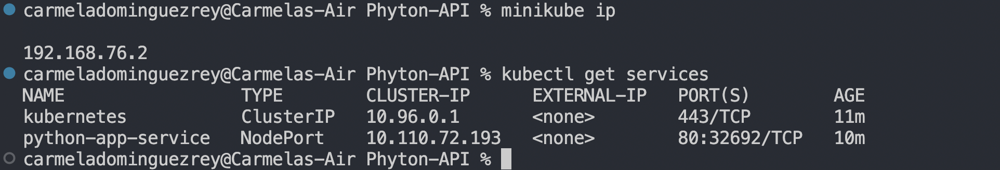

# Python API

# Python API Server Documentation

## Table of Contents

1. [Introduction](#introduction)
2. [Task 1: Develop the Python API Server](#task-1-develop-the-python-api-server)
   - [Selected Web Framework](#selected-web-framework)
   - [Project Structure](#project-structure)
   - [User Data Model](#user-data-model)
   - [API Endpoints](#api-endpoints)
   - [Input Validation and Error Handling](#input-validation-and-error-handling)
   - [Database Integration](#database-integration)
   - [Code Quality](#code-quality)

3. [Task 2: Dockerise Application](#task-2-dockerise-your-application)
   - [Dockerfile Creation](#dockerfile-creation)
   - [Dependency Files](#dependency-files)
   - [Build the Docker Image](#build-the-docker-image)
   - [Run the Docker Container](#run-the-docker-container)
   - [Access the API](#access-the-api)

4. [Task 3: Kubernetes Deployment with Manifests (Minikube)](#task-3-kubernetes-deployment-with-manifests-minikube)
   - [Install Minikube](#install-minikube)
   - [Docker Image](#docker-image)
   - [Kubernetes Manifests](#kubernetes-manifests)
   - [Access the API](#access-the-api-1)
   - [Clean Up](#clean-up)

## Introduction

Comprehensive guide to the development, containerisation, and deployment of a Python-based API server managing user data. 

## Task 1: Develop the Python API Server

### Selected Web Framework

For this project, I used Flask web framework.

### Project Structure

Directory structure. Key components include:

- `app`: Contains the Flask application.
- `app/database`: Manages the database integration.
- `app/routes`: Defines API endpoints.

### User Data Model

User data model to represent essential user information: username, email, and password.

### API Endpoints

API endpoints:

1. **POST /api/users:** Create a new user.
2. **GET /api/users/{user_id}:** Retrieve user information by user ID.

### Input Validation and Error Handling

Input validation to ensure data integrity and security. Basic error handling is implemented to provide meaningful error messages and appropriate HTTP status codes.

### Database Integration

Integrated a PostgreSQL database,implementing database operations to create and retrieve user records.

### Commands to build the db

— Create a DB with postgreSQL: `psql postgres` `CREATE DATABASE database_name;`
— Create a user: `CREATE USER my_username WITH PASSWORD 'my_password';`
— Grant access: `ALTER DATABASE database_name OWNER TO my_username;`

### Code Quality

Clean, readable code with appropriate comments and variable names is maintained.

### Commands to run and test the app

Run the app: `python3 run.py`

I used Postman to test the endpoints, with tge get and post methods:

Post users: `http://localhost:5000/api/users`

{

    "username": "example",

    "email": "example@gmail.com",

    "password": "123456"
}

Get users: `http://localhost:5000/api/users/01`

## Task 2: Dockerise Application

### Dockerfile Creation

Created a Dockerfile in the root directory of the API server project containing instructions for building a Docker image of the application.

### Dependency Files

A `requirements.txt` file in the project directory lists all the dependencies required for the  API server.

### Build the Docker Image

Build a Docker image from the Dockerfile, ensuring it and all necessary project files are in the same directory.

`docker build -t python-api .`

### Run the Docker Container

Create and start a container from the Docker image, mapping port 8080 on the host machine to port 80 in the container.

`docker run -p 8080:80 python-api`

### Access the API

Verify that the API server is running inside the Docker container. 

http://localhost:8080/api/users/

## Task 3: Kubernetes Deployment with Manifests (Minikube)

### Install Minikube

Download and install Minikube.

### Docker Image

Dockerised Python API server image is built and available on local machine.

### Kubernetes Manifests

Create the deployment.yaml and the service.yaml, the run the commands: 

`kubectl apply -f deployment.yaml`

`kubectl apply -f service.yaml `

Check status (it should be **running**):

`kubectl get deployments` 
`kubectl get pods`
`kubectl get services`

### Access the API

Access Python API server through the Minikube IP address and NodePort. Use Minikube commands to retrieve the IP and port.

Visit http://192.168.76.2:32692

Or run command `minikube service python-app-service`

### Clean Up

Delete the Kubernetes resources to free up resources.

`kubectl delete -f deployment.yaml`

`kubectl delete -f service.yaml`
